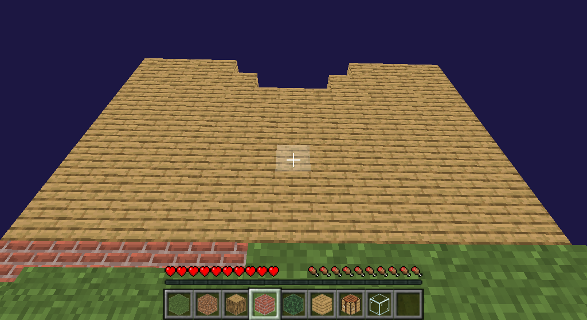

# Minecraft


[](https://gitter.im/Minecraft-in-python/community?utm_source=badge&utm_medium=badge&utm_campaign=pr-badge&utm_content=badge)

To make open source Minecraft in python.

Playing and modifying minecraft, according to your needs, will be legal. Our
wish is that you can play and modify your video game legally.

Free and transparent code is the basis of our friendly project, visit our
official [website](https://minecraft-in-python.github.io) for more information

## Play
To play Minecraft, please type in a UNIX-like terminal first:
```shell
# Github
git clone https://github.com/Minecraft-in-python/Minecraft

# Gitee
git clone https://gitee.com/Minecraft-in-python/Minecraft

cd Minecraft
./install.py
```

# Final Goals
The following TODO list is a list of features to be implemented in Minecraft:

- [x] Controla al personaje
- [x] Más plazas
- [x] Interactuar con los cubos
- [x] Generación mundial
- [x] Generación aleatoria de mundos
- [x] Un selector de archivos rudimentario
- [x] i18n (algunos idiomas)
- [x] Guardar los cambios del usuario en los mundos
- [ ] Más terreno
- [ ] Sistema de bloques
- [ ] Utilice la tecla `E` para abrir la barra de elementos
- [ ] ...

Of course, it doesn't end there, these points will evolve and change over time.
Making Minecraft more and more a high quality video game.

Are you ready to play?
Are you ready to support?

## Do you dare?




